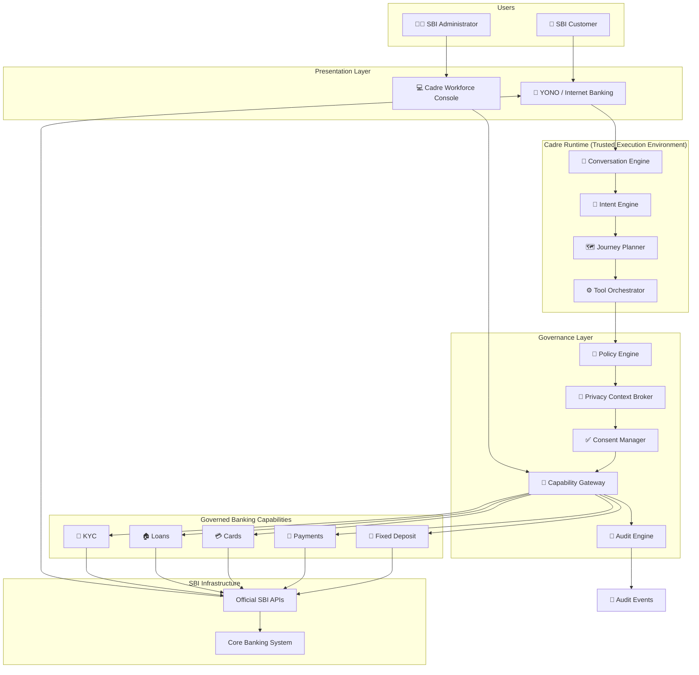
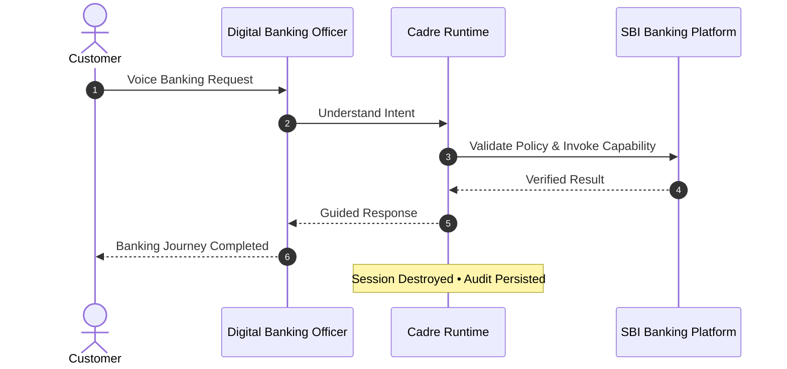

<div align="center">

# Cadre

### Building the Digital Workforce for Banking

*Banks have digitized banking infrastructure.  
Cadre enables them to digitize the workforce.*

---


</div>

---

# 🚀 Overview

Cadre is an enterprise Digital Workforce Platform that enables banks to create, govern, deploy, and manage AI-powered **Digital Employees**.

Instead of replacing existing banking infrastructure, Cadre introduces a governed intelligence layer where banks can **hire Digital Banking Officers** that assist customers throughout their digital banking journeys while operating under enterprise-grade security, governance, and compliance.

Unlike traditional AI chatbots, every Digital Banking Officer is treated like a real employee.

Every Digital Employee has:

- Identity
- Role
- Department
- Capabilities
- Operational Policies
- Permissions
- Audit Trail

Exactly like a human employee.

---

# 🎯 Problem Statement

Although banks like SBI have invested heavily in digital banking through:

- YONO
- Internet Banking
- WhatsApp Banking
- UPI
- Digital KYC

millions of customers still visit physical branches for routine banking services.

The challenge today is no longer digital infrastructure.

The challenge is the absence of trusted human guidance.

Customers frequently:

- Fear making mistakes
- Don't understand banking terminology
- Avoid digital banking for critical services
- Visit branches for assistance
- Become vulnerable to digital fraud

Existing AI chatbots answer questions.

They **do not guide customers through complete banking journeys.**

---

# 💡 Our Vision

For decades, banks have hired trained employees to guide customers inside physical branches.

Cadre extends this workforce into the digital world.

Instead of hiring another employee for a branch,

banks create a **Digital Banking Officer**.

This Digital Employee:

- Guides customers
- Explains banking procedures
- Prevents mistakes
- Validates policies
- Invokes governed banking capabilities
- Completes banking journeys

while operating entirely within enterprise governance.

---

# 🏛 Product Philosophy

Cadre is **NOT**

❌ AI Chatbot

❌ Banking Copilot

❌ Customer Support Bot

❌ Financial Advisor

Cadre is

✅ Digital Workforce Platform

Banks hire Digital Employees exactly like they hire human employees.

---

# 🌟 Key Features

## 👨‍💼 Digital Banking Officers

Voice-first AI employees that guide customers through banking journeys.

---

## 🏢 Workforce Console

Banks can:

- Create Employees
- Assign Roles
- Configure Capabilities
- Define Policies
- Deploy Employees
- Generate Employee Packages

---

## 🛡 Enterprise Governance

Every Digital Employee operates under:

- Policy Engine
- Consent Validation
- Capability Registry
- Audit Engine
- Privacy Context Broker

---

## 🔐 Privacy by Design

Cadre follows a Zero-Retention Architecture.

Customer data is never permanently stored.

Every session executes inside a Trusted Execution Environment.

After completion:

- Session Memory destroyed
- Context destroyed
- Temporary data destroyed

Only audit events persist.

---

## 🎙 Voice First Experience

Customers interact naturally.

Example:

> "I want to open a Fixed Deposit."

The Digital Banking Officer understands the intent, plans the banking journey, validates enterprise policies, invokes official banking capabilities, and guides the customer to completion.

---

# 🖥 Product Preview

## Landing Page

> *(Insert Screenshot Here)*

---

## Workforce Console

> *(Insert Screenshot Here)*

---

## Digital Employee Creation

> *(Insert Screenshot Here)*

---

## Agent in Action

> *(Insert Screenshot Here)*

---

## Architecture

> *(Insert Screenshot Here)*

---

# 🏦 How It Works

Banks create Digital Employees using Cadre.

↓

Employees are assigned

- Roles
- Capabilities
- Policies
- Security Rules

↓

Cadre generates a deployable Digital Employee Package.

↓

Banks integrate the package into existing applications.

↓

Customers interact naturally using voice.

↓

Digital Banking Officer orchestrates governed banking capabilities.

↓

Customer journey completed.

---

# ✨ Why Cadre?

Traditional Banking AI

```
Question

↓

Answer
```

Cadre

```
Customer Goal

↓

Intent Understanding

↓

Journey Planning

↓

Policy Validation

↓

Capability Invocation

↓

Customer Guidance

↓

Journey Completed
```

Cadre transforms AI from a chatbot into a governed Digital Employee.

---

# 📈 Business Impact

Cadre enables banks to:

- Increase Digital Adoption
- Reduce Branch Dependency
- Reduce Customer Support Costs
- Increase Customer Confidence
- Reduce Digital Fraud
- Accelerate Digital Transformation

---

# 🧠 Core Innovation

The innovation isn't making banking smarter.

The innovation is making AI employable.

Instead of creating another chatbot,

Cadre gives banks the ability to create governed Digital Employees that behave exactly like trained bank officers while operating securely within existing banking infrastructure.

---

# 📚 Repository Structure

```
cadre/

├── app/
├── components/
├── public/
├── runtime/
├── policy-engine/
├── capability-registry/
├── deployment-engine/
├── workforce-console/
├── docs/
├── assets/
├── README.md
└── LICENSE
```

---

# 📖 Documentation

This repository contains

- Product Vision
- Architecture
- Runtime Design
- Security Model
- Sequence Diagrams
- Technology Stack
- Deployment Guide
- Future Roadmap
# 🏗 System Architecture

Cadre is designed as a **Digital Workforce Platform** rather than an AI chatbot.

The architecture follows a layered approach where every customer interaction passes through governed runtime components before reaching official banking systems.

The LLM is **never responsible for banking decisions**.

Instead, it focuses on conversation while deterministic runtime components handle policy validation, capability selection, consent management, and banking execution.

---

# High-Level Architecture

```text
                         Customer
                              │
                              ▼
                YONO / Internet Banking
                              │
                              ▼
                  Digital Banking Officer
                              │
         ───────────────────────────────────
           Cadre Runtime (TEE Protected)
         ───────────────────────────────────
         Conversation Engine
         Intent Engine
         Journey Planner
         Tool Orchestrator
         Policy Engine
         Privacy Context Broker
         Capability Gateway
         Consent Manager
         Audit Engine
         Session Manager
         ───────────────────────────────────
                              │
                              ▼
                     Official SBI APIs
                              │
                              ▼
                   Core Banking Platform
```

---

# Enterprise Runtime Architecture



---

# Customer Journey Sequence

Every banking journey follows the same deterministic execution pipeline.



---

# Digital Employee Lifecycle

Digital Employees behave exactly like enterprise software assets.


---

# Runtime Execution Pipeline

Every customer interaction executes inside the Cadre Runtime.

```
Voice Request

↓

Conversation Engine

↓

Intent Detection

↓

Journey Planning

↓

Policy Validation

↓

Privacy Context Retrieval

↓

Capability Invocation

↓

Official SBI APIs

↓

Customer Response

↓

Audit Event

↓

Session Destroyed
```

---

# Digital Banking Officer Runtime

The runtime consists of deterministic components rather than multiple autonomous AI agents.

```
Cadre Runtime

├── Conversation Engine
│
├── Intent Engine
│
├── Journey Planner
│
├── Tool Orchestrator
│
├── Policy Engine
│
├── Privacy Context Broker
│
├── Capability Gateway
│
├── Consent Manager
│
├── Audit Engine
│
└── Session Manager
```

Every component has a single responsibility.

This architecture ensures predictable, auditable, and secure execution.

---

# Capability Gateway

Unlike traditional AI systems, the Digital Banking Officer never directly interacts with banking systems.

Instead, every request flows through the Capability Gateway.

Responsibilities include:

- Capability Discovery
- Policy Enforcement
- Authentication
- Authorization
- API Versioning
- Error Handling
- Request Transformation
- Response Normalization

This abstraction allows banks to expose governed banking capabilities without exposing internal infrastructure.

---

# Governance Model

Every Digital Banking Officer operates under enterprise governance.

```
Customer Goal

↓

Intent Detection

↓

Journey Planning

↓

Policy Validation

↓

Consent Verification

↓

Capability Invocation

↓

Audit Recording

↓

Customer Response
```

No banking operation bypasses this pipeline.

---

# Security Architecture

Cadre follows a Zero-Retention AI Architecture.

```
Customer

↓

Authenticated Session

↓

Trusted Execution Environment

↓

Temporary Runtime Context

↓

Journey Completed

↓

Destroy Session Memory

↓

Destroy Prompt Context

↓

Destroy Runtime Context

↓

Persist Audit Events Only
```

Customer banking information is never permanently stored.

---

# Privacy Context Broker

The Privacy Context Broker acts as a security boundary between the AI Runtime and banking systems.

Responsibilities:

- Retrieve minimum required banking context
- Remove sensitive identifiers
- Apply data minimization
- Enforce access policies
- Provide contextual facts instead of raw records

The Digital Banking Officer never directly receives sensitive banking data.

---

# Why We Don't Let the LLM Make Banking Decisions

The LLM is responsible only for:

- Natural conversations
- Intent understanding
- Customer guidance
- Explanation
- Multilingual communication

The LLM is **never responsible for**:

- Customer eligibility
- Banking rules
- Policy decisions
- Interest calculations
- Transaction authorization

Those decisions are handled by deterministic runtime components and official SBI systems.

---

# Trusted Execution Environment (TEE)

The complete Cadre Runtime executes inside a Trusted Execution Environment.

Benefits include:

- Confidential execution
- Memory isolation
- Runtime attestation
- Zero-Retention Sessions
- Secure policy enforcement
- Protection against unauthorized access

This enables enterprise-grade trust while processing sensitive banking interactions.

---

# Architectural Principles

Cadre is built on five guiding principles.

1. AI communicates, systems decide.

2. Policies govern every action.

3. Customer data never outlives the session.

4. Existing banking infrastructure remains the system of record.

5. Digital Employees behave exactly like governed bank employees.
# 💻 Technology Stack

Cadre is built using modern, enterprise-grade technologies with a strong focus on scalability, governance, and security.

| Layer | Technology |
|--------|------------|
| Frontend | Next.js, React, Tailwind CSS, shadcn/ui |
| Animations | Framer Motion |
| Backend | FastAPI, Python |
| Database | PostgreSQL |
| AI | Sarvam AI (STT, LLM, TTS) |
| Runtime | Cadre Runtime |
| Tool Orchestration | Strands SDK |
| APIs | REST APIs |
| Infrastructure | Docker |
| Security | Trusted Execution Environment (TEE) |
| Authentication | OAuth2 / SBI Identity |
| Deployment | Docker (Future: Kubernetes) |

---

# 📂 Project Structure

```
cadre/

├── app/
│   ├── landing/
│   ├── workforce-console/
│   ├── agent-in-action/
│   └── architecture/
│
├── components/
│   ├── ui/
│   ├── cards/
│   ├── avatar/
│   ├── phone/
│   └── charts/
│
├── runtime/
│   ├── conversation/
│   ├── intent/
│   ├── planner/
│   ├── orchestrator/
│   ├── policy/
│   ├── privacy/
│   ├── gateway/
│   ├── consent/
│   ├── audit/
│   └── session/
│
├── capability-registry/
│
├── deployment-engine/
│
├── policy-engine/
│
├── assets/
│
├── docs/
│
├── public/
│
├── README.md
│
└── LICENSE
```

---

# ⚙ Local Development

## Clone

```bash
git clone https://github.com/your-org/cadre.git

cd cadre
```

---

## Install

```bash
npm install
```

or

```bash
pnpm install
```

---

## Run

```bash
npm run dev
```

Application starts on

```
http://localhost:3000
```

---

# 🔑 Environment Variables

```
NEXT_PUBLIC_APP_NAME=Cadre

DATABASE_URL=

SARVAM_API_KEY=

JWT_SECRET=

SBI_API_BASE_URL=

SBI_CLIENT_ID=

SBI_CLIENT_SECRET=

AUDIT_SERVICE_URL=
```

---

# 🚀 Product Demonstration

The MVP demonstrates one governed Digital Employee:

**Digital Banking Officer**

### Demonstration Flow

```
Landing Page

↓

Product Vision

↓

Workforce Console

↓

Create Employee

↓

Assign Role

↓

Assign Capabilities

↓

Assign Policies

↓

Deploy Employee

↓

Generate Employee Package

↓

Integrate into SBI

↓

Agent in Action

↓

Architecture

↓

End
```

---

# 🎤 Demo Scenario

Customer:

> "I want to open a Fixed Deposit."

Digital Banking Officer:

✔ Understands intent

↓

✔ Plans journey

↓

✔ Retrieves minimum banking context

↓

✔ Validates policies

↓

✔ Invokes banking capability

↓

✔ Guides customer

↓

✔ Completes journey

↓

✔ Securely destroys session

---

# 🔐 Privacy by Design

Cadre follows Zero-Retention AI.

Customer data is **never** stored permanently.

The runtime only receives the minimum banking context required to complete the current journey.

Once completed:

- Session memory destroyed
- Prompt context destroyed
- Runtime context destroyed

Only enterprise audit logs remain.

---

# 🛡 Security Principles

Cadre follows five security principles.

### Least Privilege

Only required banking context is exposed.

---

### Policy First

Every action is validated before execution.

---

### Human Consent

Customer approval is required before sensitive actions.

---

### Zero Retention

No customer memory survives the session.

---

### Enterprise Auditability

Every banking operation produces an immutable audit event.

---

# 📦 Digital Employee Package

Every deployment generates a signed employee package.

```
DBO-001.cadre

├── employee.identity

├── runtime.bundle

├── capability.bundle

├── policy.bundle

├── manifest.yaml

├── signature.pem

├── integrations

│   ├── react/

│   ├── android/

│   ├── ios/

│   ├── node/

│   └── java/

└── README.md
```

This package is integrated into existing SBI applications.

---

# 📈 Business Model

Cadre is offered as an Enterprise SaaS platform.

Revenue Streams

- Enterprise Licensing
- On-Premise Deployment
- Private Cloud
- Professional Services
- Premium Support
- Compliance & Governance Modules

Future Expansion

- Insurance
- Government Services
- Healthcare
- Telecom
- Enterprise Customer Support

---

# 🛣 Roadmap

## Phase 1

- Workforce Console
- Digital Banking Officer
- Voice Interaction
- Mock SBI Integration

---

## Phase 2

- Real SBI APIs
- Multi-language Support
- SDK Generator
- Audit Dashboard

---

## Phase 3

- Multiple Digital Employees
- Fraud Officer
- Loan Officer
- KYC Officer
- Digital Teller

---

## Phase 4

- Marketplace
- Employee Templates
- Cross-bank Deployment
- Enterprise Analytics

---

# 🌍 Vision

We believe AI should not replace people.

It should extend the workforce.

Just as banks hire people for physical branches,

they should be able to hire Digital Employees for digital branches.

Cadre makes this possible.

---

# 🤝 Contributing

Contributions are welcome.

Please fork the repository, create a feature branch, and submit a pull request.

For major architectural changes, please open an issue first to discuss the proposal.

---

# 👥 Team

Team Name

**Corsair Devs**

Project

**Cadre**

Built for

**SBI Hackathon 2026**

---

# 📜 License

MIT License

---

# 🙏 Acknowledgements

Special thanks to

- State Bank of India
- Sarvam AI
- Strands SDK
- Open Source Community

for enabling innovation in enterprise AI.

---

<div align="center">

# Cadre

### Building the Digital Workforce for Banking

*"Banks have digitized banking.  
Cadre enables them to digitize the workforce."*

⭐ If you found this project interesting, consider giving it a star!

</div>
